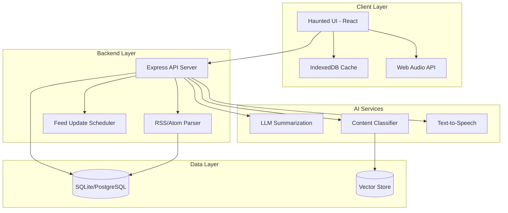

# Design Document: Haunted RSS Reader

## Overview

The Haunted RSS Reader is a web-based application that resurrects RSS technology with modern AI capabilities and a Halloween-themed interface. The architecture follows a client-server model with a React-based frontend featuring spooky animations, a Node.js/Express backend for feed processing, and integration with AI services for content analysis and summarization.

The application emphasizes real-time updates, offline-first capabilities, and an immersive themed user experience that balances aesthetics with functionality.

## Architecture

### High-Level Architecture



### Technology Stack

**Frontend:**

- React 18 with TypeScript for type safety
- Framer Motion for spooky animations and transitions
- TailwindCSS for styling with custom Halloween theme
- React Query for data fetching and caching
- IndexedDB (via Dexie.js) for offline storage
- Web Audio API for audio playback

**Backend:**

- Node.js with Express for REST API
- RSS Parser library for feed parsing
- Node-cron for scheduled feed updates
- SQLite for development, PostgreSQL for production
- OpenAI API or local LLM for summarization
- Sentence transformers for semantic similarity

**AI Integration:**

- OpenAI GPT-4 or GPT-3.5-turbo for article summarization
- OpenAI Embeddings API for semantic search and article connections
- ElevenLabs or Web Speech API for text-to-speech

## Components and Interfaces

### Frontend Components

#### 1. Haunted Layout Component

**Purpose:** Provides the main application shell with Halloween theming

**Key Features:**

- Animated background with floating ghosts, cobwebs, and fog effects
- Flickering candle navigation menu
- Pumpkin-themed loading indicators
- Eerie sound effects on interactions (optional, user-controlled)

**Props:**

```typescript
interface HauntedLayoutProps {
  children: React.ReactNode;
  theme: 'graveyard' | 'haunted-mansion' | 'witch-cottage';
  enableAnimations: boolean;
  enableSoundEffects: boolean;
}
```

#### 2. Feed List Component

**Purpose:** Displays subscribed RSS feeds with management options

**Key Features:**

- Tombstone-styled feed cards
- Ghostly hover effects
- Drag-and-drop reordering
- Status indicators (alive/dead feeds)

**Props:**

```typescript
interface FeedListProps {
  feeds: Feed[];
  onAddFeed: (url: string) => Promise<void>;
  onRemoveFeed: (feedId: string) => Promise<void>;
  onRefreshFeed: (feedId: string) => Promise<void>;
}
```

#### 3. Article Card Component

**Purpose:** Displays individual articles with AI summaries

**Key Features:**

- Scroll-like appearance for article cards
- Expandable sections for full content
- AI summary badge with glowing effect
- Topic tags as floating spirits
- Audio playback button styled as a crystal ball

**Props:**

```typescript
interface ArticleCardProps {
  article: Article;
  summary: string;
  topics: string[];
  relevanceScore: number;
  onMarkRead: () => void;
  onGenerateAudio: () => Promise<string>;
  relatedArticles: Article[];
}
```

#### 4. Digest View Component

**Purpose:** Shows curated daily/weekly digests

**Key Features:**

- Spellbook-styled digest container
- Page-turning animations between articles
- Cauldron icon for digest generation
- Potion bottle progress indicator

**Props:**

```typescript
interface DigestViewProps {
  digest: Digest;
  onRegenerateDigest: () => Promise<void>;
  frequency: 'daily' | 'weekly' | 'on-demand';
}
```

#### 5. Search Component

**Purpose:** Provides search and filtering capabilities

**Key Features:**

- Ouija board-styled search interface
- Mystical search suggestions
- Filter options as spell ingredients
- Results appear with fade-in ghost effect

**Props:**

```typescript
interface SearchComponentProps {
  onSearch: (query: string, filters: SearchFilters) => Promise<SearchResult[]>;
  recentSearches: string[];
}
```

### Backend API Endpoints

#### Feed Management

```
POST   /api/feeds              - Add new feed
GET    /api/feeds              - List all feeds
DELETE /api/feeds/:id          - Remove feed
PUT    /api/feeds/:id/refresh  - Manually refresh feed
```

#### Articles

```
GET    /api/articles                    - Get articles (paginated, filtered)
GET    /api/articles/:id                - Get single article with full content
GET    /api/articles/:id/summary        - Get AI summary
GET    /api/articles/:id/audio          - Generate/retrieve audio summary
GET    /api/articles/:id/related        - Get related articles
POST   /api/articles/:id/feedback       - Submit user feedback (like/dislike)
```

#### Digests

```
GET    /api/digests/latest              - Get latest digest
POST   /api/digests/generate            - Generate new digest
PUT    /api/digests/preferences         - Update digest preferences
```

#### Search

```
GET    /api/search?q=query&filters=...  - Search articles
GET    /api/topics/trending             - Get trending topics
```

#### User Preferences

```
GET    /api/preferences                 - Get user preferences
PUT    /api/preferences                 - Update preferences
```

## Data Models

### Feed Model

```typescript
interface Feed {
  id: string;
  url: string;
  title: string;
  description: string;
  lastFetched: Date;
  fetchInterval: number; // minutes
  status: 'active' | 'error' | 'paused';
  errorMessage?: string;
  articleCount: number;
  createdAt: Date;
  updatedAt: Date;
}
```

### Article Model

```typescript
interface Article {
  id: string;
  feedId: string;
  title: string;
  link: string;
  content: string;
  excerpt: string;
  author?: string;
  publishedAt: Date;
  fetchedAt: Date;

  // AI-generated fields
  summary?: string;
  topics: string[];
  entities: string[];
  sentiment: 'positive' | 'neutral' | 'negative';
  relevanceScore: number;
  embedding?: number[]; // Vector embedding for similarity

  // User interaction
  isRead: boolean;
  isFavorite: boolean;
  userFeedback?: 'like' | 'dislike';

  // Audio
  audioUrl?: string;
  audioDuration?: number;
}
```

### Digest Model

```typescript
interface Digest {
  id: string;
  generatedAt: Date;
  period: {
    start: Date;
    end: Date;
  };
  articles: Article[];
  summary: string;
  topTopics: string[];
  type: 'daily' | 'weekly' | 'custom';
}
```

### User Preferences Model

```typescript
interface UserPreferences {
  id: string;

  // Content preferences
  interests: string[]; // Topics of interest
  excludedTopics: string[];
  preferredSources: string[]; // Feed IDs

  // Digest settings
  digestFrequency: 'daily' | 'weekly' | 'off';
  digestTime: string; // HH:MM format
  digestArticleCount: number;

  // Notification settings
  enableNotifications: boolean;
  notificationThreshold: number; // Relevance score threshold

  // UI preferences
  theme: 'graveyard' | 'haunted-mansion' | 'witch-cottage';
  enableAnimations: boolean;
  enableSoundEffects: boolean;

  // AI settings
  summaryLength: 'short' | 'medium' | 'long';
  audioVoice: string;
  audioSpeed: number;
}
```

### Article Connection Model

```typescript
interface ArticleConnection {
  id: string;
  article1Id: string;
  article2Id: string;
  connectionType: 'topic' | 'entity' | 'semantic';
  strength: number; // 0-1 similarity score
  sharedElements: string[];
}
```

## Error Handling

### Feed Fetching Errors

- **Network Errors:** Retry with exponential backoff (3 attempts), mark feed as temporarily unavailable
- **Parse Errors:** Log error details, notify user with specific issue, provide option to remove feed
- **Invalid Feed Format:** Validate feed structure, provide helpful error message with format requirements
- **Rate Limiting:** Implement respectful fetching intervals, honor feed's update frequency

### AI Service Errors

- **API Timeout:** Set 30-second timeout, fallback to original article excerpt
- **Rate Limit Exceeded:** Queue requests, implement request throttling, show user-friendly message
- **Invalid Response:** Log error, retry once, fallback to basic text processing
- **Cost Management:** Implement daily API usage limits, cache summaries aggressively

### Storage Errors

- **Quota Exceeded:** Implement LRU cache eviction, notify user, provide storage management UI
- **Database Connection:** Retry connection, show offline mode, queue operations for sync
- **Corruption:** Implement data validation, provide database repair utility

### UI Error Boundaries

- Component-level error boundaries with spooky error messages
- Graceful degradation of animations if performance issues detected
- Fallback UI for critical failures with recovery options

## Testing Strategy

### Unit Tests

**Focus:** Individual functions and utilities

- Feed parser validation
- AI summary generation logic
- Relevance scoring algorithm
- Date/time utilities
- Text processing functions

**Tools:** Jest, React Testing Library

### Integration Tests

**Focus:** Component interactions and API endpoints

- Feed CRUD operations
- Article fetching and processing pipeline
- Search functionality
- Digest generation
- Audio generation workflow

**Tools:** Jest, Supertest, MSW (Mock Service Worker)

### End-to-End Tests

**Focus:** Critical user flows

- Add feed → View articles → Read summary → Play audio
- Configure preferences → Generate digest → Review content
- Search articles → Filter results → Open article
- Offline mode → Sync when online

**Tools:** Playwright or Cypress

### Performance Tests

- Feed parsing speed (target: <2s for 100 articles)
- AI summary generation (target: <10s per article)
- UI rendering with animations (target: 60fps)
- Search response time (target: <2s)
- Offline cache retrieval (target: <500ms)

### Accessibility Tests

- Keyboard navigation through all features
- Screen reader compatibility
- Color contrast ratios (ensure readability despite dark theme)
- Focus indicators visible on all interactive elements
- ARIA labels for decorative Halloween elements

**Tools:** axe-core, Lighthouse, manual testing

### Visual Regression Tests

- Screenshot comparison for themed components
- Animation consistency across browsers
- Responsive design breakpoints

**Tools:** Percy or Chromatic

## Halloween UI Design Specifications

### Color Palette

```css
--haunted-black: #0a0a0a --graveyard-gray: #1a1a1a --ghost-white: #f0f0f0 --pumpkin-orange: #ff6b35
  --witch-purple: #6a0dad --poison-green: #39ff14 --blood-red: #8b0000
  --fog-gray: rgba(200, 200, 200, 0.1);
```

### Typography

- **Headers:** "Creepster" or "Nosifer" (Google Fonts)
- **Body:** "Roboto" or "Inter" for readability
- **Accent:** "Special Elite" for typewriter effects

### Animation Effects

1. **Floating Ghosts:** Subtle parallax scrolling background elements
2. **Flickering Candles:** CSS animation on navigation items
3. **Cobweb Transitions:** SVG path animations between page transitions
4. **Glowing Effects:** Pulsing box-shadow on interactive elements
5. **Fog Overlay:** Animated gradient overlay with low opacity
6. **Page Curl:** 3D transform on article cards when hovering

### Themed Icons

- Feed icon: Tombstone
- Refresh: Spinning cauldron
- Audio: Crystal ball
- Search: Magnifying glass with spider
- Settings: Witch hat
- Notifications: Bat
- Favorite: Heart with dripping effect

### Loading States

- Skeleton screens with ghostly shimmer effect
- Spinning pumpkin for long operations
- Bubbling cauldron for AI processing
- Floating spirits for background sync

## Performance Optimizations

### Frontend

- Lazy load article content and images
- Virtual scrolling for large article lists
- Debounce search input (300ms)
- Memoize expensive computations (relevance scoring)
- Code splitting by route
- Optimize animation performance with CSS transforms
- Service Worker for offline functionality

### Backend

- Cache AI summaries indefinitely (content doesn't change)
- Batch feed fetching operations
- Use database indexes on frequently queried fields
- Implement Redis for session and temporary data
- Rate limit API endpoints
- Compress API responses with gzip

### AI Integration

- Batch summarization requests when possible
- Use streaming responses for real-time feedback
- Implement request queuing to avoid rate limits
- Cache embeddings for semantic search
- Use smaller models for classification tasks

## Security Considerations

- Sanitize all RSS feed content to prevent XSS attacks
- Validate feed URLs before fetching
- Implement rate limiting on API endpoints
- Use HTTPS for all external requests
- Secure API keys in environment variables
- Implement CORS policies
- Sanitize user input in search queries
- Use Content Security Policy headers
- Implement authentication if multi-user support added

## Deployment Architecture

### Development

- Local SQLite database
- Mock AI services for testing
- Hot reload for frontend and backend

### Production

- PostgreSQL database with connection pooling
- Redis for caching and job queues
- CDN for static assets
- Containerized deployment (Docker)
- Environment-based configuration
- Automated backups
- Monitoring and logging (e.g., Sentry, LogRocket)

## Future Enhancements

- Multi-user support with authentication
- Social features (share articles, collaborative digests)
- Browser extension for quick feed subscription
- Mobile app (React Native)
- OPML import/export for feed migration
- Custom AI model fine-tuning on user preferences
- Podcast feed support with audio player
- Integration with read-it-later services
- Advanced analytics dashboard
- Community-curated feed recommendations
